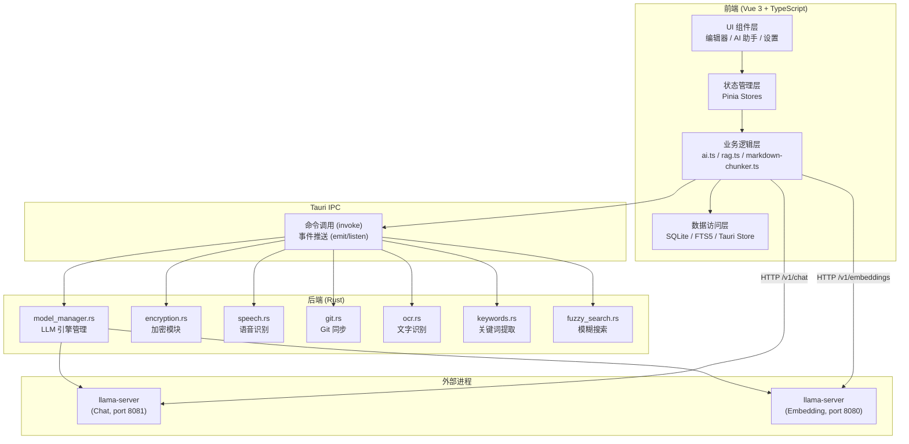

<div align="center">

# Rikka Note

**隐私优先 · AI 原生 · 本地化 · 零配置**

一款面向普通个人用户的跨平台智能笔记应用

Built with **Tauri 2** + **Vue 3** + **Rust**

[](LICENSE)


</div>

---

## 目录

- [项目简介](#项目简介)
- [核心特性](#核心特性)
- [截图预览](#截图预览)
- [技术栈](#技术栈)
- [系统架构](#系统架构)
- [快速开始](#快速开始)
- [项目结构](#项目结构)
- [国际化支持](#国际化支持)
- [许可证](#许可证)
- [致谢](#致谢)

---

## 项目简介

Rikka Note 是一款以"隐私、智能、本地化"为核心理念的跨平台智能笔记应用。在不依赖云端服务的前提下，为用户提供完整的 AI 辅助笔记能力——包括本地大语言模型（LLM）推理、本地语音识别（ASR）、本地向量检索（RAG）、端到端笔记加密以及零配置的一键部署体验。

**为什么选择 Rikka Note？**

- **数据完全属于你**：所有笔记、AI 对话记录、向量索引均存储在本地设备，不经过任何第三方服务器
- **AI 能力开箱即用**：一键自动检测硬件、下载引擎和模型、启动服务，无需任何技术背景
- **云端/本地自由切换**：支持本地模型和云端 API 的无缝切换，统一接口透明调用
- **轻量高性能**：基于 Tauri 2 + Rust 构建，安装包约 30 MB，内存占用远低于 Electron 方案

---

## 核心特性

### AI 智能助手

- **多模型支持**：统一 OpenAI 兼容接口，支持本地模型（llama.cpp）和云端 API（OpenAI、Gemini 等）自由切换
- **流式对话**：逐 token 实时渲染 AI 回复，支持深度思考过程可视化（可折叠思维链展示）
- **AI 编辑协同**：选区级精准改写，行级 Diff 差异预览，一键应用/撤销，对标专业 IDE 的代码审查体验
- **Prompt 预设库**：内置多种场景化指令（知识提取、翻译、扩写等），支持自定义 Prompt 管理
- **AI 知识图谱**：一键从笔记生成 Mermaid 可视化图谱（流程图、思维导图、时序图等 14 种类型），支持节点点击跳转至源文对应行

### 多模态输入

- **离线语音识别 (ASR)**：集成 Sherpa-ONNX + SenseVoice 模型，Rust 驱动的 VAD 语音活动检测，高精度离线语音转文字
- **离线 OCR**：基于 Windows Runtime API 的屏幕截图区域文字识别
- **AI 视觉增强 (VLM)**：自动分析笔记内图片，生成结构化文本描述，让图片内容可检索、可理解

### RAG 检索增强系统

- **混合检索架构**：稠密向量检索（Dense）与 BM25 关键词检索（Sparse）双路并行，Reciprocal Rank Fusion (RRF) 排名融合
- **结构感知分块**：基于 Markdown AST 的智能分块，保持文档逻辑完整性，支持可选的语义边界检测
- **Rerank 精排**：可选的交叉编码器精排阶段，置信度过滤低质量结果
- **隐私确认流**：两步发送机制——在将笔记内容发送至 LLM 前，可视化展示检索到的分块，用户可逐条审查、剔除或取消
- **内置评估框架**：基于 RAGAS 理论的六维度自动化评估（忠实度、回答相关性、上下文精度、上下文召回率、答案正确性、答案完整性），支持回归测试与趋势分析

### 隐私与安全

- **端到端加密**：XChaCha20-Poly1305 认证加密 + Argon2id 密钥派生，KEK/DEK 双层密钥架构
- **Rust 级安全**：所有密码学运算在 Rust 进程中执行，前端 JavaScript 层不接触任何密钥材料
- **内存安全**：密钥材料使用 Zeroize 机制保护，锁定后自动安全清零
- **O(1) 密码变更**：修改密码仅需重新加密 104 字节密钥文件，无需遍历所有加密笔记

### 零配置本地 AI 部署

- **GPU 自动检测**：自动识别 NVIDIA/AMD/Intel 显卡，推荐最优引擎版本（CUDA / Vulkan / CPU）
- **一键部署流水线**：点击按钮即可完成引擎下载、解压、模型获取、服务启动的全链路自动化
- **多实例并行**：Embedding 服务与 Chat 服务独立运行，互不干扰
- **服务生命周期管理**：自动就绪检测、异常恢复、进程清理、状态轮询

### 编辑器

- **所见即所得**：基于 md-editor-v3 的高性能 Markdown 编辑器，编辑-预览双模式
- **丰富的扩展**：KaTeX 数学公式、Mermaid 图表、ECharts 数据可视化、代码高亮、图片裁剪
- **完全离线渲染**：所有扩展库本地加载，无需 CDN
- **自动保存**：300ms 防抖自动保存，多文件缓冲区管理

### 数据同步

- **内置 Git 客户端**：基于 libgit2（静态编译），无需安装 Git 命令行工具
- **一键同步**：Pull + Push 一键完成，支持"本地优先"和"远程优先"冲突策略
- **工作区隔离**：每个工作区独立的 Git 仓库配置

### 界面与体验

- **三栏生产力布局**：文件管理器 + 编辑器 + AI 助手，模块可动态折叠
- **Canvas 动态背景**：基于粒子动力学的 3D 线框几何体和流体样条曲线动画，跟随系统主题自动切换
- **明暗双主题**：四色品牌色体系（六花紫、六花青、六花粉、六花橙），自动适配系统主题
- **8 语言国际化**：中文、English、日本語、한국어、Français、Deutsch、Español、Русский
- **自定义工具栏**：编辑器工具栏可配置，按需裁剪界面

---

## 截图预览

<!-- 请根据实际截图文件调整路径 -->


---

## 技术栈

### 前端

| 技术 | 用途 |
|------|------|
| **Vue 3** (Composition API) | UI 框架 |
| **TypeScript 5.6** | 类型安全 |
| **Vite 6** | 构建工具 |
| **Pinia 3** | 状态管理 |
| **Tailwind CSS 3** | 样式框架 |
| **Reka UI** | 无头 UI 组件库 |
| **md-editor-v3** | Markdown 编辑器 |
| **OpenAI SDK** | 统一 AI 接口 |
| **Mermaid** | 图表渲染 |
| **vue-i18n** | 国际化 |
| **Splitpanes** | 面板分割布局 |
| **Lucide Icons** | 图标库 |

### 后端 (Rust)

| 技术 | 用途 |
|------|------|
| **Tauri 2.x** | 跨端框架 |
| **chacha20poly1305** | 认证加密 (AEAD) |
| **argon2** | 密钥派生 (KDF) |
| **zeroize** | 内存安全清零 |
| **sherpa-onnx** | 离线语音识别 |
| **cpal** | 跨平台音频采集 |
| **git2** (vendored libgit2) | Git 操作 |
| **jieba-rs** (TextRank) | 中文分词与关键词提取 |
| **reqwest** | 异步 HTTP 客户端 |
| **tokio** | 异步运行时 |
| **rayon** | 并行计算 |
| **xcap** | 屏幕截图 |
| **windows-rs** | Windows API (OCR) |

### 数据存储

| 技术 | 用途 |
|------|------|
| **SQLite** (tauri-plugin-sql) | 聊天记录、向量数据、图谱缓存 |
| **FTS5** | 全文检索虚表 (BM25) |
| **Tauri Store** | 键值配置持久化 |
| **本地文件系统** | Markdown 笔记文件 |

---

## 系统架构



---

## 快速开始

### 环境要求

| 工具 | 版本 |
|------|------|
| **Node.js** | >= 22.x |
| **npm** | >= 10.x |
| **Rust** | >= 1.81.0 |
| **Cargo** | >= 1.81.0 |

> Tauri 2 的系统依赖请参考 [Tauri 官方文档](https://v2.tauri.app/start/prerequisites/)。
> Windows 用户需安装 [Visual Studio Build Tools](https://visualstudio.microsoft.com/visual-cpp-build-tools/)（含 C++ 桌面开发工作负载）。

### 安装与开发

```bash
# 克隆仓库
git clone https://github.com/remnant-song/rikka-note.git
cd rikka-note

# 安装前端依赖
npm install

# 启动开发模式（同时启动 Vite 前端和 Tauri 后端）
npm run tauri dev
```

### 构建生产版本

```bash
# 构建可分发的安装包
npm run tauri build
```

构建产物位于 `src-tauri/target/release/bundle/`，包含：
- **Windows**: NSIS 安装包 (`.exe`) 和 MSI 安装包
- **macOS**: `.dmg` 和 `.app`
- **Linux**: `.deb`、`.AppImage` 和 `.rpm`

---

## 项目结构

```
rikka-note/
├── src-tauri/                          # Rust 后端（Tauri 核心）
│   ├── Cargo.toml                      # Rust 依赖配置
│   ├── tauri.conf.json                 # Tauri 应用配置
│   ├── capabilities/                   # Tauri 2.0 权限声明
│   ├── icons/                          # 应用图标
│   └── src/
│       ├── main.rs                     # 桌面端入口
│       ├── lib.rs                      # 移动端入口（共享命令子集）
│       ├── app_setup.rs                # 应用初始化（托盘、窗口事件）
│       ├── model_manager.rs            # LLM 引擎与模型管理
│       ├── encryption.rs               # 加密模块（KEK/DEK）
│       ├── speech.rs                   # 语音识别（Sherpa-ONNX）
│       ├── git.rs                      # Git 同步（libgit2）
│       ├── ocr.rs                      # OCR（Windows Runtime）
│       ├── screenshot.rs               # 屏幕截图（xcap）
│       ├── keywords.rs                 # 关键词提取（jieba TextRank）
│       ├── fuzzy_search.rs             # 并行模糊搜索
│       ├── backup.rs                   # 数据导入导出
│       ├── tray.rs                     # 系统托盘
│       └── window.rs                   # 窗口管理
│
├── src/                                # Vue 3 前端
│   ├── main.ts                         # 前端入口
│   ├── App.vue                         # 根组件
│   ├── core/                           # 核心业务组件
│   │   ├── layouts/                    #   布局（三栏、标题栏）
│   │   ├── pages/                      #   页面
│   │   │   ├── setting/                #     设置（本地模型/RAG/加密/同步/语音）
│   │   │   ├── search/                 #     全局搜索
│   │   │   ├── ocr/                    #     OCR 截图
│   │   │   └── about/                  #     关于
│   │   └── panels/                     #   面板
│   │       ├── explorer/               #     文件资源管理器
│   │       ├── editor/                 #     Markdown 编辑器
│   │       └── assistant/              #     AI 助手（聊天/图谱）
│   ├── components/                     # 通用 UI 组件
│   ├── composables/                    # Vue 组合式函数
│   ├── db/                             # 数据库访问层
│   │   ├── index.ts                    #   SQLite 连接管理
│   │   ├── vector.ts                   #   向量数据库（主表 + FTS5）
│   │   ├── chats.ts                    #   聊天消息
│   │   ├── chat_sessions.ts            #   聊天会话
│   │   └── graph.ts                    #   知识图谱缓存
│   ├── lib/                            # 核心业务逻辑
│   │   ├── ai.ts                       #   统一 AI 接口
│   │   ├── rag.ts                      #   RAG 检索管道
│   │   ├── markdown-chunker.ts         #   AST 结构感知分块
│   │   ├── search-fusion.ts            #   RRF 排名融合
│   │   ├── rag-evaluator.ts            #   RAG 质量评估
│   │   └── benchmark-runner.ts         #   回归测试运行器
│   ├── stores/                         # Pinia 状态仓库
│   │   ├── setting.ts                  #   全局设置
│   │   ├── article.ts                  #   文章/文件管理
│   │   ├── chat.ts                     #   聊天会话
│   │   ├── encryption.ts               #   加密状态
│   │   ├── vector.ts                   #   向量数据库
│   │   ├── workspace.ts                #   工作区
│   │   └── ...                         #   其他仓库
│   ├── locales/                        # 多语言资源（8 种语言）
│   ├── router/                         # 路由配置（桌面端/移动端）
│   ├── shared/                         # 共享样式
│   └── types/                          # TypeScript 类型定义
│
├── public/                             # 静态资源
├── index.html                          # HTML 入口
├── package.json                        # 前端依赖
├── vite.config.ts                      # Vite 构建配置
├── tailwind.config.ts                  # Tailwind CSS 配置
├── tsconfig.json                       # TypeScript 配置
└── LICENSE                             # AGPL-3.0 许可证
```

---

## 国际化支持

Rikka Note 支持以下 8 种语言：

| 语言 | 代码 | 文件 |
|------|------|------|
| 简体中文 | `zh` | `src/locales/zh.json` |
| English | `en` | `src/locales/en.json` |
| 日本語 | `ja` | `src/locales/ja.json` |
| 한국어 | `ko` | `src/locales/ko.json` |
| Français | `fr` | `src/locales/fr.json` |
| Deutsch | `de` | `src/locales/de.json` |
| Español | `es` | `src/locales/es.json` |
| Русский | `ru` | `src/locales/ru.json` |

---

## 平台支持

| 功能 | Windows | macOS | Linux |
|------|---------|-------|-------|
| 编辑器核心 | ✅ | ✅ | ✅ |
| AI 对话（云端） | ✅ | ✅ | ✅ |
| 本地 LLM 推理 | ✅ | ✅ | ✅ |
| 离线语音识别 | ✅ | ✅ | ✅ |
| OCR 文字识别 | ✅ | ❌ | ❌ |
| GPU 自动检测 | ✅ | ❌ | ❌ |
| 笔记加密 | ✅ | ✅ | ✅ |
| Git 同步 | ✅ | ✅ | ✅ |
| RAG 检索 | ✅ | ✅ | ✅ |

> OCR 和 GPU 自动检测目前依赖 Windows 平台 API，其他平台的适配在规划中。

---

## 许可证

本项目基于 [GNU Affero General Public License v3.0 (AGPL-3.0)](LICENSE) 开源。

---

## 致谢

Rikka Note 的实现建立在众多优秀开源项目的基础之上：

- [Tauri](https://tauri.app/) — 高性能跨端应用框架
- [Vue.js](https://vuejs.org/) — 渐进式 JavaScript 框架
- [llama.cpp](https://github.com/ggerganov/llama.cpp) — 本地 LLM 推理引擎
- [Sherpa-ONNX](https://github.com/k2-fsa/sherpa-onnx) — 离线语音识别
- [md-editor-v3](https://github.com/imzbf/md-editor-v3) — Markdown 编辑器组件
- [Reka UI](https://reka-ui.com/) — 无头 UI 组件库
- [Mermaid](https://mermaid.js.org/) — 图表渲染引擎
- [libgit2](https://libgit2.org/) — Git 操作库
- [jieba-rs](https://github.com/messense/jieba-rs) — 中文分词

感谢所有开源贡献者的无私奉献。

---


