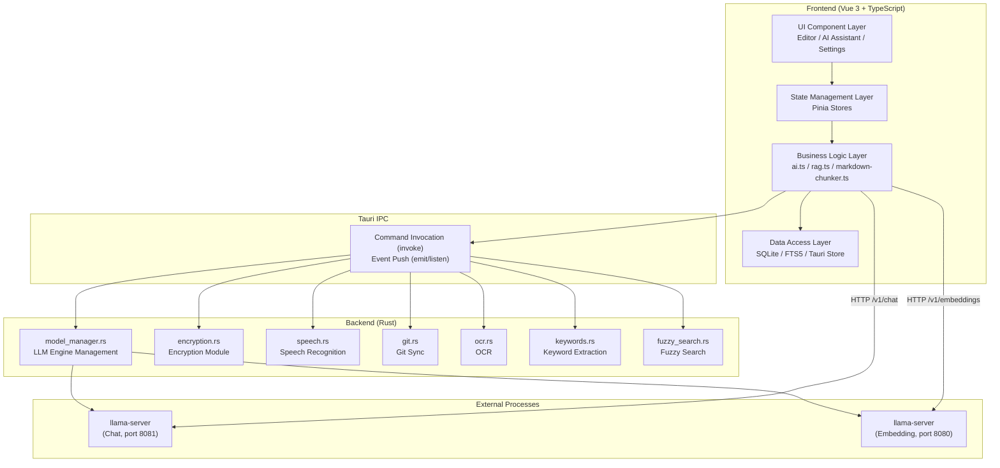

<div align="center">
    
  
  
# Rikka Note

**Privacy-First · AI-Native · Local-First · Zero-Configuration**

A cross-platform smart note-taking application designed for everyday users.

Built with **Tauri 2** + **Vue 3** + **Rust**

[](LICENSE)


<br>
<br>
**[中文README](README-zh.md)**
</div>

---

## Table of Contents

- [Introduction](#introduction)
- [Core Features](#core-features)
- [Screenshots](#screenshots)
- [Tech Stack](#tech-stack)
- [System Architecture](#system-architecture)
- [Quick Start](#quick-start)
- [Project Structure](#project-structure)
- [Internationalization](#internationalization)
- [Platform Support](#platform-support)
- [License](#license)
- [Acknowledgements](#acknowledgements)

---

## Introduction

Rikka Note is a cross-platform smart note-taking application built around the core principles of **privacy, intelligence, and local-first operation**. Without relying on cloud services, it offers a complete set of AI-assisted note-taking capabilities — including local large language model (LLM) inference, local automatic speech recognition (ASR), local vector retrieval (RAG), end-to-end note encryption, and a zero‑configuration one‑click deployment experience.

**Why Rikka Note?**

- **Your data belongs to you** – All notes, AI conversations, and vector indexes stay on your local device; they never pass through any third‑party servers.
- **AI capabilities, ready to use** – One click automatically detects your hardware, downloads the engine and models, and starts the service – no technical background required.
- **Cloud / local, switch freely** – Seamlessly switch between local models and cloud APIs with a unified interface.
- **Lightweight & high‑performance** – Built with Tauri 2 + Rust, the installer is around 30 MB, and memory usage is far lower than Electron‑based solutions.

---

## Core Features

### AI Smart Assistant

- **Multiple model support** – Unified OpenAI‑compatible interface, freely switch between local models (llama.cpp) and cloud APIs (OpenAI, Gemini, etc.).
- **Streaming conversations** – Real‑time token‑by‑token rendering of AI replies, with optional visualisation of deep‑thinking processes (collapsible chain‑of‑thought display).
- **AI editing collaboration** – Selection‑level precise rewriting, line‑by‑line diff preview, one‑click apply / revert – a code‑review experience on par with professional IDEs.
- **Prompt library** – Built‑in prompts for various scenarios (knowledge extraction, translation, expansion, etc.), with support for custom prompt management.
- **AI knowledge graph** – One‑click generation of Mermaid visualisations (flowcharts, mind maps, sequence diagrams, and 14 other types) from notes; clicking a node jumps to the corresponding line in the source document.

### Multimodal Input

- **Offline speech recognition (ASR)** – Integrates Sherpa‑ONNX + SenseVoice models, with Rust‑driven VAD (voice activity detection) for high‑accuracy offline speech‑to‑text.
- **Offline OCR** – Screen capture region text recognition using the Windows Runtime API.
- **AI vision enhancement (VLM)** – Automatically analyse images in notes and generate structured text descriptions, making image content searchable and understandable.

### RAG Retrieval‑Augmented Generation

- **Hybrid retrieval architecture** – Dual‑path dense vector retrieval + BM25 keyword retrieval, combined with Reciprocal Rank Fusion (RRF) for final ranking.
- **Structure‑aware chunking** – AST‑based intelligent chunking of Markdown documents, preserving logical integrity, with optional semantic boundary detection.
- **Reranking** – Optional cross‑encoder reranking stage with confidence filtering to remove low‑quality results.
- **Privacy confirmation flow** – Two‑step send mechanism: before sending note content to the LLM, retrieved chunks are displayed visually; users can review, remove, or cancel each chunk.
- **Built‑in evaluation framework** – Six‑dimension automated evaluation based on RAGAS theory (faithfulness, answer relevancy, context precision, context recall, answer correctness, answer completeness), with regression testing and trend analysis support.

### Privacy & Security

- **End‑to‑end encryption** – XChaCha20‑Poly1305 authenticated encryption + Argon2id key derivation, KEK/DEK two‑layer key architecture.
- **Rust‑level security** – All cryptographic operations execute inside the Rust process; the frontend JavaScript layer never touches any key material.
- **Memory safety** – Key material protected using the `Zeroize` mechanism, automatically and securely zeroed when locked.
- **O(1) password change** – Changing your password only requires re‑encrypting a 104‑byte key file – no need to traverse every encrypted note.

### Zero‑Configuration Local AI Deployment

- **Automatic GPU detection** – Automatically recognises NVIDIA / AMD / Intel GPUs and recommends the optimal engine version (CUDA / Vulkan / CPU).
- **One‑click deployment pipeline** – A single button triggers the entire automation: engine download, unpacking, model acquisition, and service startup.
- **Multi‑instance parallel execution** – Embedding service and chat service run independently without interfering with each other.
- **Service lifecycle management** – Automatic readiness checking, anomaly recovery, process cleanup, and status polling.

### Editor

- **WYSIWYG** – High‑performance Markdown editor based on md‑editor‑v3, with edit + preview dual modes.
- **Rich extensions** – KaTeX math formulas, Mermaid diagrams, ECharts data visualisation, code highlighting, image cropping.
- **Fully offline rendering** – All extension libraries are loaded locally – no CDN required.
- **Auto‑save** – 300ms debounced auto‑save with multi‑file buffer management.

### Data Synchronisation

- **Built‑in Git client** – Based on libgit2 (statically compiled) – no need to install the Git command‑line tool.
- **One‑click sync** – Pull + Push in one action, with support for "local first" and "remote first" conflict strategies.
- **Workspace isolation** – Each workspace maintains its own independent Git repository configuration.

### Interface & Experience

- **Three‑column productivity layout** – File explorer + Editor + AI Assistant, modules can be dynamically collapsed.
- **Canvas dynamic backgrounds** – 3D wireframe geometry and fluid spline animations based on particle dynamics; automatically switches with system theme.
- **Light & dark themes** – Four brand colour schemes (Rikka Purple, Rikka Cyan, Rikka Pink, Rikka Orange), automatically adapting to system theme.
- **8‑language internationalisation** – Chinese, English, 日本語, 한국어, Français, Deutsch, Español, Русский.
- **Customisable toolbar** – Editor toolbar can be configured to tailor the interface to your needs.

---

## Screenshots

<!-- Adjust paths according to your actual screenshot files -->


---

## Tech Stack

### Frontend

| Technology | Purpose |
|------------|---------|
| **Vue 3** (Composition API) | UI framework |
| **TypeScript 5.6** | Type safety |
| **Vite 6** | Build tool |
| **Pinia 3** | State management |
| **Tailwind CSS 3** | Styling framework |
| **Reka UI** | Headless UI components |
| **md-editor-v3** | Markdown editor |
| **OpenAI SDK** | Unified AI interface |
| **Mermaid** | Diagram rendering |
| **vue-i18n** | Internationalisation |
| **Splitpanes** | Pane split layout |
| **Lucide Icons** | Icon library |

### Backend (Rust)

| Technology | Purpose |
|------------|---------|
| **Tauri 2.x** | Cross‑platform framework |
| **chacha20poly1305** | Authenticated encryption (AEAD) |
| **argon2** | Key derivation (KDF) |
| **zeroize** | Secure memory zeroing |
| **sherpa-onnx** | Offline speech recognition |
| **cpal** | Cross‑platform audio capture |
| **git2** (vendored libgit2) | Git operations |
| **jieba-rs** (TextRank) | Chinese word segmentation & keyword extraction |
| **reqwest** | Asynchronous HTTP client |
| **tokio** | Asynchronous runtime |
| **rayon** | Parallel computation |
| **xcap** | Screenshots |
| **windows-rs** | Windows API (OCR) |

### Data Storage

| Technology | Purpose |
|------------|---------|
| **SQLite** (tauri-plugin-sql) | Chat history, vector data, graph cache |
| **FTS5** | Full‑text search virtual table (BM25) |
| **Tauri Store** | Key‑value persistent configuration |
| **Local file system** | Markdown note files |

---

## System Architecture



---

## Quick Start

### Requirements

| Tool | Version |
|------|---------|
| **Node.js** | >= 22.x |
| **npm** | >= 10.x |
| **Rust** | >= 1.81.0 |
| **Cargo** | >= 1.81.0 |

> For Tauri 2 system dependencies, refer to the [Tauri documentation](https://v2.tauri.app/start/prerequisites/).
> Windows users need to install [Visual Studio Build Tools](https://visualstudio.microsoft.com/visual-cpp-build-tools/) with the "Desktop development with C++" workload.

### Installation & Development

```bash
# Clone the repository
git clone https://github.com/remnant-song/rikka-note.git
cd rikka-note

# Install frontend dependencies
npm install

# Start development mode (runs both Vite frontend and Tauri backend)
npm run tauri dev
```

### Production Build

```bash
# Build distributable installers
npm run tauri build
```

Build artifacts are located in `src-tauri/target/release/bundle/`:
- **Windows**: NSIS installer (`.exe`) and MSI installer
- **macOS**: `.dmg` and `.app`
- **Linux**: `.deb`, `.AppImage`, and `.rpm`

---

## Project Structure

```
rikka-note/
├── src-tauri/                          # Rust backend (Tauri core)
│   ├── Cargo.toml                      # Rust dependencies
│   ├── tauri.conf.json                 # Tauri application configuration
│   ├── capabilities/                   # Tauri 2.0 permission declarations
│   ├── icons/                          # Application icons
│   └── src/
│       ├── main.rs                     # Desktop entry point
│       ├── lib.rs                      # Mobile entry point (shared command subset)
│       ├── app_setup.rs                # App initialisation (tray, window events)
│       ├── model_manager.rs            # LLM engine & model management
│       ├── encryption.rs               # Encryption module (KEK/DEK)
│       ├── speech.rs                   # Speech recognition (Sherpa-ONNX)
│       ├── git.rs                      # Git sync (libgit2)
│       ├── ocr.rs                      # OCR (Windows Runtime)
│       ├── screenshot.rs               # Screenshots (xcap)
│       ├── keywords.rs                 # Keyword extraction (jieba TextRank)
│       ├── fuzzy_search.rs             # Parallel fuzzy search
│       ├── backup.rs                   # Data import/export
│       ├── tray.rs                     # System tray
│       └── window.rs                   # Window management
│
├── src/                                # Vue 3 frontend
│   ├── main.ts                         # Frontend entry point
│   ├── App.vue                         # Root component
│   ├── core/                           # Core business components
│   │   ├── layouts/                    #   Layouts (three‑column, title bar)
│   │   ├── pages/                      #   Pages
│   │   │   ├── setting/                #     Settings (local model/RAG/encryption/sync/speech)
│   │   │   ├── search/                 #     Global search
│   │   │   ├── ocr/                    #     OCR screenshot
│   │   │   └── about/                  #     About
│   │   └── panels/                     #   Panels
│   │       ├── explorer/               #     File explorer
│   │       ├── editor/                 #     Markdown editor
│   │       └── assistant/              #     AI assistant (chat/graph)
│   ├── components/                     # Reusable UI components
│   ├── composables/                    # Vue composition functions
│   ├── db/                             # Database access layer
│   │   ├── index.ts                    #   SQLite connection management
│   │   ├── vector.ts                   #   Vector database (main table + FTS5)
│   │   ├── chats.ts                    #   Chat messages
│   │   ├── chat_sessions.ts            #   Chat sessions
│   │   └── graph.ts                    #   Knowledge graph cache
│   ├── lib/                            # Core business logic
│   │   ├── ai.ts                       #   Unified AI interface
│   │   ├── rag.ts                      #   RAG retrieval pipeline
│   │   ├── markdown-chunker.ts         #   AST‑based structure‑aware chunking
│   │   ├── search-fusion.ts            #   RRF rank fusion
│   │   ├── rag-evaluator.ts            #   RAG quality evaluation
│   │   └── benchmark-runner.ts         #   Regression test runner
│   ├── stores/                         # Pinia state stores
│   │   ├── setting.ts                  #   Global settings
│   │   ├── article.ts                  #   Article/file management
│   │   ├── chat.ts                     #   Chat sessions
│   │   ├── encryption.ts               #   Encryption state
│   │   ├── vector.ts                   #   Vector database
│   │   ├── workspace.ts                #   Workspace
│   │   └── ...                         #   Other stores
│   ├── locales/                        # Multi‑language resources (8 languages)
│   ├── router/                         # Routing configuration (desktop/mobile)
│   ├── shared/                         # Shared styles
│   └── types/                          # TypeScript type definitions
│
├── public/                             # Static assets
├── index.html                          # HTML entry
├── package.json                        # Frontend dependencies
├── vite.config.ts                      # Vite build configuration
├── tailwind.config.ts                  # Tailwind CSS configuration
├── tsconfig.json                       # TypeScript configuration
└── LICENSE                             # AGPL-3.0 license
```

---

## Internationalization

Rikka Note supports the following 8 languages:

| Language | Code | File |
|----------|------|------|
| Simplified Chinese | `zh` | `src/locales/zh.json` |
| English | `en` | `src/locales/en.json` |
| 日本語 | `ja` | `src/locales/ja.json` |
| 한국어 | `ko` | `src/locales/ko.json` |
| Français | `fr` | `src/locales/fr.json` |
| Deutsch | `de` | `src/locales/de.json` |
| Español | `es` | `src/locales/es.json` |
| Русский | `ru` | `src/locales/ru.json` |

---

## Platform Support

| Feature | Windows | macOS | Linux |
|---------|---------|-------|-------|
| Core editor | ✅ | ✅ | ✅ |
| AI chat (cloud) | ✅ | ✅ | ✅ |
| Local LLM inference | ✅ | ✅ | ✅ |
| Offline speech recognition | ✅ | ✅ | ✅ |
| OCR | ✅ | ❌ | ❌ |
| Automatic GPU detection | ✅ | ❌ | ❌ |
| Note encryption | ✅ | ✅ | ✅ |
| Git sync | ✅ | ✅ | ✅ |
| RAG retrieval | ✅ | ✅ | ✅ |

> OCR and automatic GPU detection currently rely on Windows platform APIs; support for other platforms is planned.

---

## License

This project is open‑sourced under the [GNU Affero General Public License v3.0 (AGPL-3.0)](LICENSE).

---

## Acknowledgements

Rikka Note is built on the shoulders of many excellent open‑source projects:

- [Tauri](https://tauri.app/) – High‑performance cross‑platform application framework
- [Vue.js](https://vuejs.org/) – Progressive JavaScript framework
- [llama.cpp](https://github.com/ggerganov/llama.cpp) – Local LLM inference engine
- [Sherpa-ONNX](https://github.com/k2-fsa/sherpa-onnx) – Offline speech recognition
- [md-editor-v3](https://github.com/imzbf/md-editor-v3) – Markdown editor component
- [Reka UI](https://reka-ui.com/) – Headless UI component library
- [Mermaid](https://mermaid.js.org/) – Diagram rendering engine
- [libgit2](https://libgit2.org/) – Git operations library
- [jieba-rs](https://github.com/messense/jieba-rs) – Chinese word segmentation

Thank you to all open‑source contributors for their selfless dedication.

--- 
